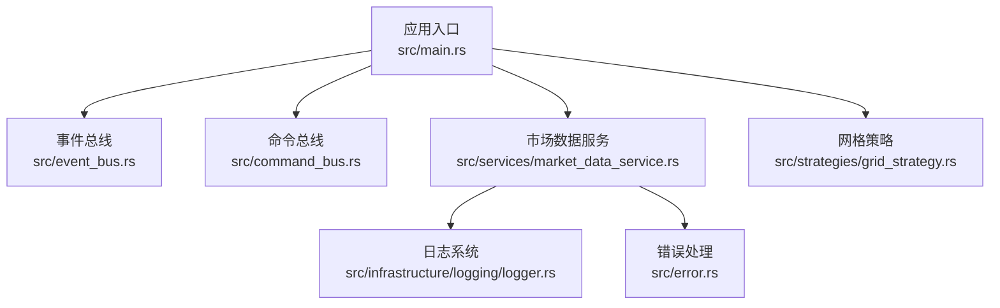
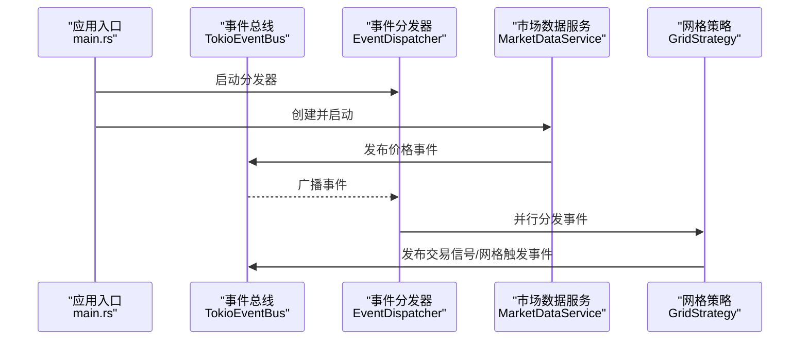
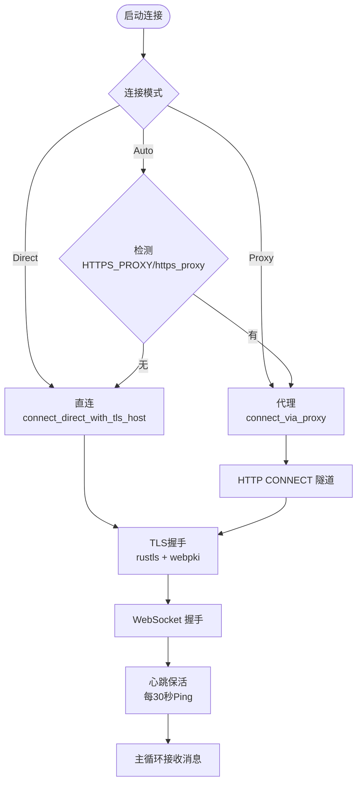
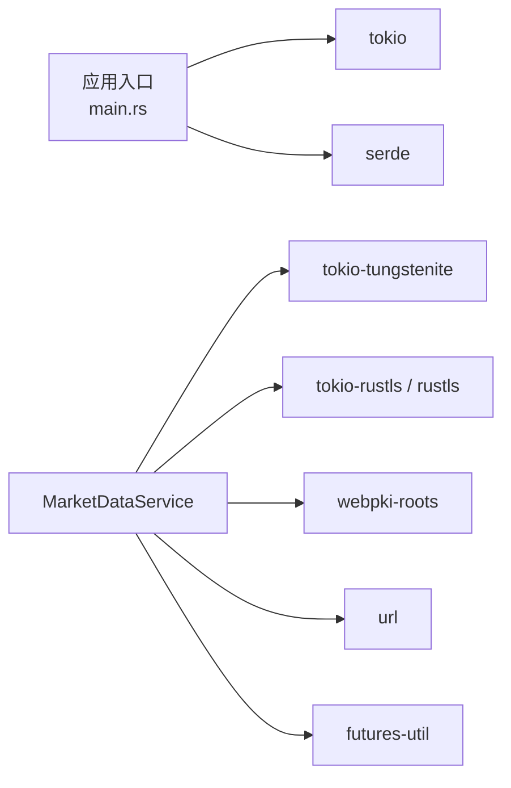

# 部署配置

<cite>
**本文引用的文件**
- [Cargo.toml](file://Cargo.toml)
- [main.rs](file://src/main.rs)
- [market_data_service.rs](file://src/services/market_data_service.rs)
- [grid_strategy.rs](file://src/strategies/grid_strategy.rs)
- [CODE_EXPLANATION.md](file://docs/CODE_EXPLANATION.md)
- [EVENT_DRIVEN_REFACTOR_GUIDE.md](file://docs/EVENT_DRIVEN_REFACTOR_GUIDE.md)
- [logger.rs](file://src/infrastructure/logging/logger.rs)
- [error.rs](file://src/error.rs)
</cite>

## 目录
1. [简介](#简介)
2. [项目结构](#项目结构)
3. [核心组件](#核心组件)
4. [架构总览](#架构总览)
5. [详细组件分析](#详细组件分析)
6. [依赖关系分析](#依赖关系分析)
7. [性能考虑](#性能考虑)
8. [故障排查指南](#故障排查指南)
9. [结论](#结论)
10. [附录](#附录)

## 简介
本文件面向运维与平台工程团队，提供在不同环境中部署与运行 Binance Rust 事件驱动交易系统的完整配置指南。内容覆盖：
- 网络连接模式（Direct、Proxy、Auto）与 WebSocket 连接配置
- 代理设置与 SSL/TLS 证书配置
- 环境变量配置（HTTPS_PROXY、USE_SSH_TUNNEL 等）
- Docker 容器化部署参考（docker-compose.yml 与 Dockerfile）
- Kubernetes 部署资源清单（Deployment、Service、ConfigMap、Secret）
- 云平台部署建议（AWS、GCP、Azure）
- 性能调优参数（线程池、缓冲区、超时等）

## 项目结构
该系统采用事件驱动架构，核心由事件总线、市场数据服务、策略引擎与基础设施组成。WebSocket 连接与代理支持位于市场数据服务模块；日志与错误处理位于基础设施模块。

图表来源
- [main.rs:10-93](file://src/main.rs#L10-L93)
- [market_data_service.rs:34-42](file://src/services/market_data_service.rs#L34-L42)
- [grid_strategy.rs:156-182](file://src/strategies/grid_strategy.rs#L156-L182)
- [logger.rs:17-79](file://src/infrastructure/logging/logger.rs#L17-L79)
- [error.rs:36-83](file://src/error.rs#L36-L83)

章节来源
- [main.rs:10-93](file://src/main.rs#L10-L93)
- [Cargo.toml:6-24](file://Cargo.toml#L6-L24)

## 核心组件
- 事件总线与分发器：负责事件发布、订阅与并行分发。
- 市场数据服务：负责连接 Binance WebSocket，支持直连与代理（HTTP CONNECT 隧道），并内置自动重连与心跳保活。
- 网格策略：监听价格事件，按网格区间生成交易信号。
- 日志系统：支持文本/JSON 格式、文件轮转、缓冲区大小配置。
- 错误处理：统一的领域错误与基础设施错误类型。

章节来源
- [market_data_service.rs:23-42](file://src/services/market_data_service.rs#L23-L42)
- [grid_strategy.rs:26-81](file://src/strategies/grid_strategy.rs#L26-L81)
- [logger.rs:17-79](file://src/infrastructure/logging/logger.rs#L17-L79)
- [error.rs:36-83](file://src/error.rs#L36-L83)

## 架构总览
系统通过事件总线实现松耦合：市场数据服务产生价格事件，策略引擎订阅并生成交易信号，后续可接入风控与订单执行模块。

图表来源
- [main.rs:14-22](file://src/main.rs#L14-L22)
- [market_data_service.rs:304-374](file://src/services/market_data_service.rs#L304-L374)
- [grid_strategy.rs:264-278](file://src/strategies/grid_strategy.rs#L264-L278)

## 详细组件分析

### 网络连接与 WebSocket 配置
- 连接模式
  - Auto：自动检测环境变量 HTTPS_PROXY 或 https_proxy，若存在则使用代理，否则直连。
  - Direct：强制直连，忽略代理设置。
  - Proxy：强制使用代理，需提供 HTTPS_PROXY 或 https_proxy。
- 代理隧道
  - 通过 HTTP CONNECT 隧道建立到目标主机的 TLS 通道，随后进行 WebSocket 握手。
  - 支持代理认证（用户名/密码）与超时控制。
- TLS 证书
  - 使用 rustls + webpki roots 进行证书校验，确保端到端加密。
- 重连与心跳
  - 连接失败自动重连，心跳每 30 秒一次，Ping/Pong 保活。
- SSH 隧道
  - USE_SSH_TUNNEL 环境变量开启时，连接本地端口并通过 TLS 校验 stream.binance.com 主机名。

图表来源
- [market_data_service.rs:137-177](file://src/services/market_data_service.rs#L137-L177)
- [market_data_service.rs:231-301](file://src/services/market_data_service.rs#L231-L301)
- [market_data_service.rs:197-229](file://src/services/market_data_service.rs#L197-L229)

章节来源
- [market_data_service.rs:23-42](file://src/services/market_data_service.rs#L23-L42)
- [market_data_service.rs:116-178](file://src/services/market_data_service.rs#L116-L178)
- [market_data_service.rs:231-301](file://src/services/market_data_service.rs#L231-L301)
- [market_data_service.rs:303-374](file://src/services/market_data_service.rs#L303-L374)
- [CODE_EXPLANATION.md:284-310](file://docs/CODE_EXPLANATION.md#L284-L310)

### 环境变量配置
- HTTPS_PROXY / https_proxy：代理地址（HTTP CONNECT 隧道），格式为 http://host:port 或 socks5://host:port。
- USE_SSH_TUNNEL：启用 SSH 隧道模式，连接本地端口并以 stream.binance.com 作为 TLS 主机名。
- BINANCE_API_KEY / BINANCE_API_SECRET：用于后续订单执行模块（当前示例未使用）。
- LOG_LEVEL：日志级别（结合日志系统配置）。
- 事件驱动示例中还演示了通过环境变量控制代理与直连的使用方式。

章节来源
- [market_data_service.rs:142-147](file://src/services/market_data_service.rs#L142-L147)
- [market_data_service.rs:130-135](file://src/services/market_data_service.rs#L130-L135)
- [CODE_EXPLANATION.md:728-738](file://docs/CODE_EXPLANATION.md#L728-L738)

### 日志系统配置
- 日志级别：支持 Info/Debug 等级别。
- 输出格式：文本或 JSON。
- 文件轮转：按大小轮转，最大文件数可配置。
- 缓冲区大小：可调，默认值可按性能需求调整。
- 异步日志：后台线程落盘，降低主线程阻塞。

章节来源
- [logger.rs:17-79](file://src/infrastructure/logging/logger.rs#L17-L79)
- [logger.rs:283-290](file://src/infrastructure/logging/logger.rs#L283-L290)

### 错误处理与可观测性
- 统一错误类型：基础设施、事件总线、服务层错误分类清晰。
- 日志记录：事件处理失败、连接异常、TLS 握手失败等均有日志输出。
- 建议：结合外部监控系统（如 Prometheus/Grafana）采集运行指标。

章节来源
- [error.rs:36-83](file://src/error.rs#L36-L83)
- [grid_strategy.rs:264-278](file://src/strategies/grid_strategy.rs#L264-L278)

## 依赖关系分析
系统依赖 tokio、tokio-tungstenite、tokio-rustls、rustls、webpki-roots、serde、futures-util、url 等，用于异步运行时、WebSocket、TLS 与序列化。

图表来源
- [Cargo.toml:6-24](file://Cargo.toml#L6-L24)
- [main.rs:1-8](file://src/main.rs#L1-L8)
- [market_data_service.rs:6-21](file://src/services/market_data_service.rs#L6-L21)

章节来源
- [Cargo.toml:6-24](file://Cargo.toml#L6-L24)

## 性能考虑
- 事件总线容量：根据峰值吞吐设置广播通道容量，避免背压丢失。
- 并发分发：EventDispatcher 并行调用所有订阅处理器，建议按处理器职责拆分，避免单点瓶颈。
- WebSocket 心跳：30 秒 Ping 保活，建议结合网络质量调整。
- 日志缓冲与轮转：增大缓冲区与轮转阈值可降低磁盘 IO，但需平衡内存占用。
- TLS 优化：使用系统根证书缓存，避免重复加载；在高并发场景可考虑连接池复用（当前实现为按需连接）。
- 网格策略：避免在事件处理中进行重型计算，必要时异步化或引入工作线程池。

章节来源
- [logger.rs:45-79](file://src/infrastructure/logging/logger.rs#L45-L79)
- [market_data_service.rs:323-333](file://src/services/market_data_service.rs#L323-L333)
- [EVENT_DRIVEN_REFACTOR_GUIDE.md:1120-1147](file://docs/EVENT_DRIVEN_REFACTOR_GUIDE.md#L1120-L1147)

## 故障排查指南
- 代理连接失败
  - 确认 HTTPS_PROXY/https_proxy 环境变量正确，格式合法。
  - 检查代理服务器可达性与认证配置。
- TLS 握手失败
  - 校验证书链与主机名校验，确保 webpki-roots 可用。
- WebSocket 握手超时
  - 检查网络延迟与防火墙策略，适当增大 connect_timeout。
- 心跳中断
  - 检查中间设备（NAT/代理）是否清理空闲连接，调整心跳周期。
- 日志异常
  - 检查日志文件权限、磁盘空间与轮转配置。

章节来源
- [market_data_service.rs:167-173](file://src/services/market_data_service.rs#L167-L173)
- [market_data_service.rs:223-228](file://src/services/market_data_service.rs#L223-L228)
- [logger.rs:283-290](file://src/infrastructure/logging/logger.rs#L283-L290)

## 结论
本文提供了在不同环境下部署与运行 Binance Rust 事件驱动交易系统的配置指南，重点覆盖网络连接模式、代理与 TLS、环境变量、日志与错误处理，并给出性能调优建议。后续可在此基础上扩展订单执行与风控模块，完善生产级监控与告警体系。

## 附录

### Docker 容器化部署参考
- docker-compose.yml（示例思路）
  - 服务：定义镜像、环境变量（HTTPS_PROXY、USE_SSH_TUNNEL、BINANCE_API_KEY/SECRET）、卷挂载（日志目录）、端口映射（如需）。
  - 网络：自定义网络隔离。
  - 健康检查：基于日志输出或内部 HTTP 探针。
- Dockerfile（示例思路）
  - 基础镜像：Debian/Alpine。
  - 工具链：安装 Rust 编译工具链，构建 release。
  - 运行用户：非 root 用户运行。
  - 入口命令：执行二进制。

说明：以上为通用容器化实践建议，具体镜像与编排可根据团队规范定制。

### Kubernetes 部署资源清单（示例思路）
- Deployment
  - replicas：副本数（建议至少 2 以实现滚动更新与高可用）。
  - podTemplate：环境变量、资源请求/限制、探针。
  - updateStrategy：滚动更新策略。
- Service
  - ClusterIP/LoadBalancer：暴露内部服务或对外访问。
- ConfigMap
  - 存放非敏感配置（如日志级别、事件总线容量）。
- Secret
  - 存放敏感配置（BINANCE_API_KEY/SECRET、代理认证凭据）。

### 云平台部署建议
- AWS
  - EC2：使用 IAM Role 与 VPC 安全组，配合 ECS/EKS 部署。
  - Lambda（边缘场景）：受限于运行时长度，不适合长连接服务。
- GCP
  - Compute Engine 或 GKE，结合 Cloud NAT/代理与 Secret Manager。
- Azure
  - VMSS/AKS，利用 Azure Key Vault 与网络安全组。

### 运行参数与调优建议
- 连接参数
  - reconnect_interval：默认 5 秒，网络抖动较大时可适度增大。
  - connect_timeout：默认 30 秒，弱网可提升至 60 秒。
- 事件总线
  - 容量：根据峰值事件速率估算，避免广播通道溢出。
- 日志
  - buffer_size：默认 1024，高吞吐可提升至 8192。
  - rotate_size：默认 400MB，可根据磁盘与保留策略调整。
- 网格策略
  - grid_count：根据波动率与资金规模设定网格数量。
  - quantity_per_grid：单网格下单金额，注意风控限额。

章节来源
- [market_data_service.rs:78-94](file://src/services/market_data_service.rs#L78-L94)
- [logger.rs:45-79](file://src/infrastructure/logging/logger.rs#L45-L79)
- [grid_strategy.rs:26-43](file://src/strategies/grid_strategy.rs#L26-L43)