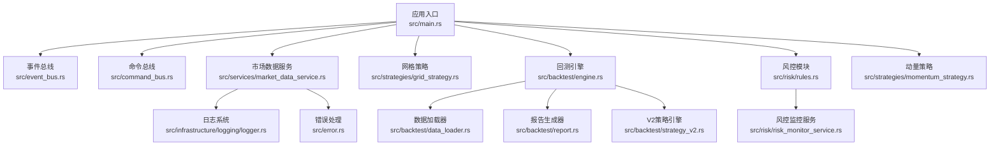
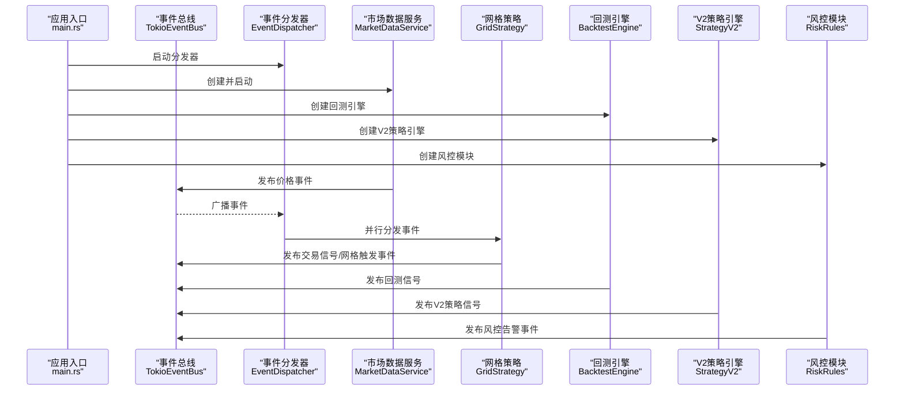
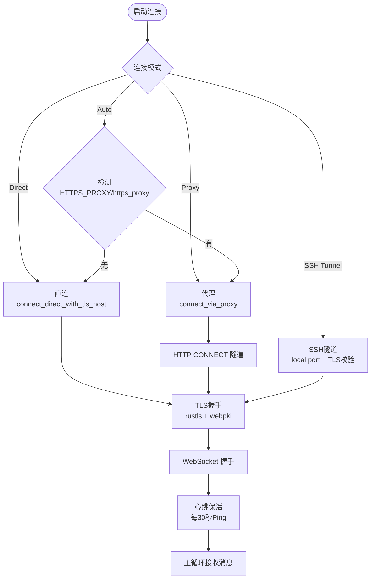
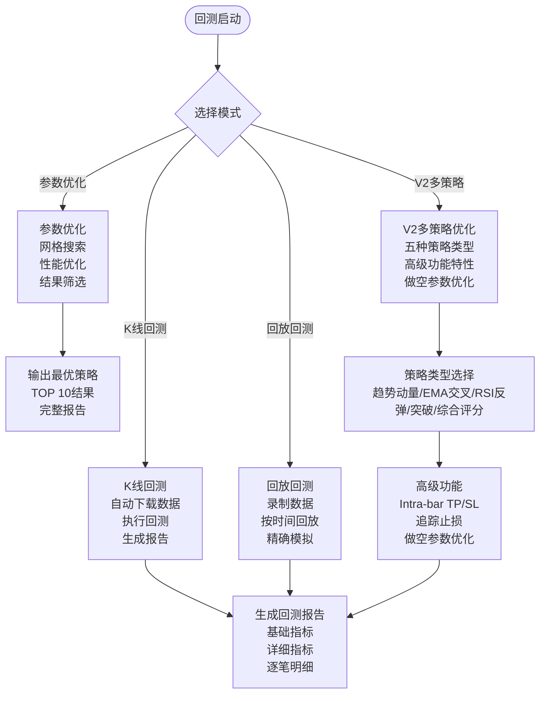
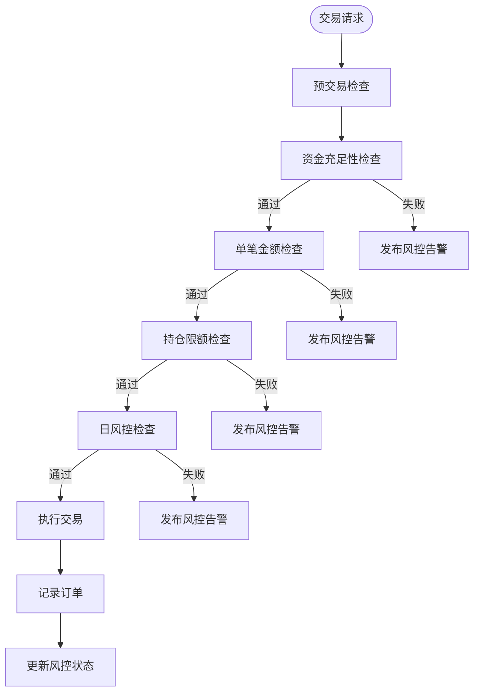
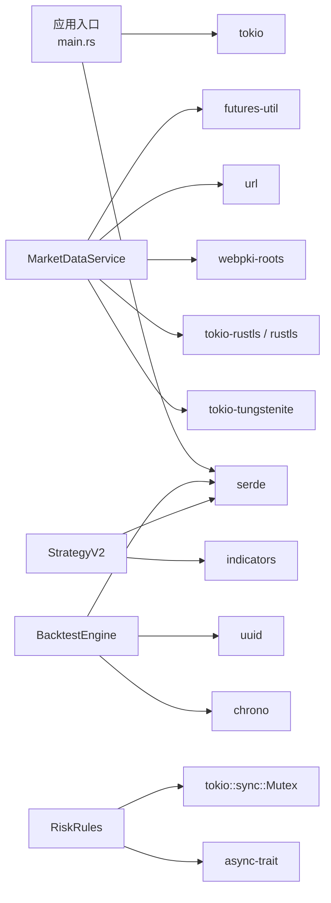

# 部署配置

<cite>
**本文引用的文件**
- [Cargo.toml](file://Cargo.toml)
- [main.rs](file://src/main.rs)
- [market_data_service.rs](file://src/services/market_data_service.rs)
- [grid_strategy.rs](file://src/strategies/grid_strategy.rs)
- [backtest.rs](file://src/bin/backtest.rs)
- [engine.rs](file://src/backtest/engine.rs)
- [data_loader.rs](file://src/backtest/data_loader.rs)
- [recorder.rs](file://src/backtest/recorder.rs)
- [report.rs](file://src/backtest/report.rs)
- [strategy_v2.rs](file://src/backtest/strategy_v2.rs)
- [rules.rs](file://src/risk/rules.rs)
- [risk_monitor_service.rs](file://src/risk/risk_monitor_service.rs)
- [config.rs](file://src/config.rs)
- [default.toml](file://config/default.toml)
- [risk_events.rs](file://src/events/risk_events.rs)
- [CODE_EXPLANATION.md](file://docs/CODE_EXPLANATION.md)
- [EVENT_DRIVEN_REFACTOR_GUIDE.md](file://docs/EVENT_DRIVEN_REFACTOR_GUIDE.md)
- [logger.rs](file://src/infrastructure/logging/logger.rs)
- [error.rs](file://src/error.rs)
- [momentum_strategy.rs](file://src/strategies/momentum_strategy.rs)
</cite>

## 更新摘要
**变更内容**
- 新增V2多策略回测系统配置，支持趋势动量、EMA交叉、RSI反弹、突破策略和综合评分五种策略类型
- 新增Intra-bar止盈止损和追踪止损等高级回测功能
- 更新回测模式说明，包括K线回测、参数优化、回放回测和V2多策略优化四种模式
- 新增做空策略支持和专门的做空参数配置
- 更新环境变量配置，增加回测和风控相关配置项
- 新增Docker容器化部署的回测和风控模块配置
- 更新Kubernetes部署资源清单，增加回测和风控服务
- 新增云平台部署的回测和风控模块配置建议
- **重大更新**：移除策略特定配置，引入统一的策略类型参数，V2多策略优化配置

## 目录
1. [简介](#简介)
2. [项目结构](#项目结构)
3. [核心组件](#核心组件)
4. [架构总览](#架构总览)
5. [详细组件分析](#详细组件分析)
6. [回测系统配置](#回测系统配置)
7. [风控模块配置](#风控模块配置)
8. [依赖关系分析](#依赖关系分析)
9. [性能考虑](#性能考虑)
10. [故障排查指南](#故障排查指南)
11. [结论](#结论)
12. [附录](#附录)

## 简介
本文件面向运维与平台工程团队，提供在不同环境中部署与运行 Binance Rust 事件驱动交易系统的完整配置指南。内容覆盖：
- 网络连接模式（Direct、Proxy、Auto、SSH Tunnel）与 WebSocket 连接配置
- 代理设置与 SSL/TLS 证书配置
- 环境变量配置（HTTPS_PROXY、USE_SSH_TUNNEL、BINANCE_API_KEY、BINANCE_SECRET_KEY等）
- Docker 容器化部署参考（docker-compose.yml 与 Dockerfile）
- Kubernetes 部署资源清单（Deployment、Service、ConfigMap、Secret）
- 云平台部署建议（AWS、GCP、Azure）
- 回测系统配置（K线回测、参数优化、回放回测、V2多策略优化，支持五种策略类型）
- 风控模块配置（风控规则、监控服务、告警机制）
- 性能调优参数（线程池、缓冲区、超时等）

## 项目结构
该系统采用事件驱动架构，核心由事件总线、市场数据服务、策略引擎、回测系统、风控模块与基础设施组成。WebSocket 连接与代理支持位于市场数据服务模块；日志与错误处理位于基础设施模块；回测系统提供历史数据回测功能；风控模块提供交易前风险检查。



**图表来源**
- [main.rs:10-93](file://src/main.rs#L10-L93)
- [market_data_service.rs:34-42](file://src/services/market_data_service.rs#L34-L42)
- [grid_strategy.rs:156-182](file://src/strategies/grid_strategy.rs#L156-L182)
- [engine.rs:110-122](file://src/backtest/engine.rs#L110-L122)
- [rules.rs:12-16](file://src/risk/rules.rs#L12-L16)
- [logger.rs:17-79](file://src/infrastructure/logging/logger.rs#L17-L79)
- [error.rs:36-83](file://src/error.rs#L36-L83)
- [momentum_strategy.rs:214-235](file://src/strategies/momentum_strategy.rs#L214-L235)

**章节来源**
- [main.rs:10-93](file://src/main.rs#L10-L93)
- [Cargo.toml:6-24](file://Cargo.toml#L6-L24)

## 核心组件
- 事件总线与分发器：负责事件发布、订阅与并行分发。
- 市场数据服务：负责连接 Binance WebSocket，支持直连与代理（HTTP CONNECT 隧道），并内置自动重连与心跳保活。
- 网格策略：监听价格事件，按网格区间生成交易信号。
- 回测引擎：提供历史数据回测、参数优化、回放回测和V2多策略优化功能，支持五种策略类型。
- 风控模块：提供交易前风险检查、实时监控和告警机制。
- 日志系统：支持文本/JSON 格式、文件轮转、缓冲区大小配置。
- 错误处理：统一的领域错误与基础设施错误类型。

**章节来源**
- [market_data_service.rs:23-42](file://src/services/market_data_service.rs#L23-L42)
- [grid_strategy.rs:26-81](file://src/strategies/grid_strategy.rs#L26-L81)
- [engine.rs:110-122](file://src/backtest/engine.rs#L110-L122)
- [rules.rs:12-16](file://src/risk/rules.rs#L12-L16)
- [logger.rs:17-79](file://src/infrastructure/logging/logger.rs#L17-L79)
- [error.rs:36-83](file://src/error.rs#L36-L83)

## 架构总览
系统通过事件总线实现松耦合：市场数据服务产生价格事件，策略引擎订阅并生成交易信号，回测系统提供策略验证能力，风控模块确保交易安全性，后续可接入订单执行模块。



**图表来源**
- [main.rs:14-22](file://src/main.rs#L14-L22)
- [market_data_service.rs:304-374](file://src/services/market_data_service.rs#L304-L374)
- [grid_strategy.rs:264-278](file://src/strategies/grid_strategy.rs#L264-278)
- [engine.rs:124-134](file://src/backtest/engine.rs#L124-L134)
- [strategy_v2.rs:188-372](file://src/backtest/strategy_v2.rs#L188-L372)
- [rules.rs:53-68](file://src/risk/rules.rs#L53-L68)

## 详细组件分析

### 网络连接与 WebSocket 配置
- 连接模式
  - Auto：自动检测环境变量 HTTPS_PROXY 或 https_proxy，若存在则使用代理，否则直连。
  - Direct：强制直连，忽略代理设置。
  - Proxy：强制使用代理，需提供 HTTPS_PROXY 或 https_proxy。
  - SSH Tunnel：通过本地端口连接，使用 stream.binance.com 作为 TLS 主机名。
- 代理隧道
  - 通过 HTTP CONNECT 隧道建立到目标主机的 TLS 通道，随后进行 WebSocket 握手。
  - 支持代理认证（用户名/密码）与超时控制。
- TLS 证书
  - 使用 rustls + webpki roots 进行证书校验，确保端到端加密。
- 重连与心跳
  - 连接失败自动重连，心跳每 30 秒一次，Ping/Pong 保活。
- SSH 隧道
  - USE_SSH_TUNNEL 环境变量开启时，连接本地端口并通过 TLS 校验 stream.binance.com 主机名。



**图表来源**
- [market_data_service.rs:137-177](file://src/services/market_data_service.rs#L137-L177)
- [market_data_service.rs:231-301](file://src/services/market_data_service.rs#L231-L301)
- [market_data_service.rs:197-229](file://src/services/market_data_service.rs#L197-L229)

**章节来源**
- [market_data_service.rs:23-42](file://src/services/market_data_service.rs#L23-L42)
- [market_data_service.rs:116-178](file://src/services/market_data_service.rs#L116-L178)
- [market_data_service.rs:231-301](file://src/services/market_data_service.rs#L231-L301)
- [market_data_service.rs:303-374](file://src/services/market_data_service.rs#L303-L374)
- [CODE_EXPLANATION.md:284-310](file://docs/CODE_EXPLANATION.md#L284-L310)

### 环境变量配置
- HTTPS_PROXY / https_proxy：代理地址（HTTP CONNECT 隧道），格式为 http://host:port 或 socks5://host:port。
- USE_SSH_TUNNEL：启用 SSH 隧道模式，连接本地端口并以 stream.binance.com 作为 TLS 主机名。
- BINANCE_API_KEY / BINANCE_SECRET_KEY：Binance API 密钥，用于订单执行模块。
- BINANCE_TESTNET：切换到测试网模式。
- LOG_LEVEL：日志级别（结合日志系统配置）。
- BACKTEST_DATA_DIR：回测数据目录。
- RISK_CONFIG_PATH：风控配置文件路径。

**章节来源**
- [market_data_service.rs:142-147](file://src/services/market_data_service.rs#L142-L147)
- [market_data_service.rs:130-135](file://src/services/market_data_service.rs#L130-L135)
- [config.rs:103-109](file://src/config.rs#L103-L109)
- [CODE_EXPLANATION.md:728-738](file://docs/CODE_EXPLANATION.md#L728-L738)

### 日志系统配置
- 日志级别：支持 Trace/Debug/Info/Warn/Error 等级别。
- 输出格式：文本或 JSON。
- 文件轮转：按大小轮转，最大文件数可配置。
- 缓冲区大小：可调，默认值可按性能需求调整。
- 异步日志：后台线程落盘，降低主线程阻塞。

**章节来源**
- [logger.rs:17-79](file://src/infrastructure/logging/logger.rs#L17-L79)
- [logger.rs:283-290](file://src/infrastructure/logging/logger.rs#L283-L290)

### 错误处理与可观测性
- 统一错误类型：基础设施、事件总线、服务层错误分类清晰。
- 日志记录：事件处理失败、连接异常、TLS 握手失败等均有日志输出。
- 建议：结合外部监控系统（如 Prometheus/Grafana）采集运行指标。

**章节来源**
- [error.rs:36-83](file://src/error.rs#L36-L83)
- [grid_strategy.rs:264-278](file://src/strategies/grid_strategy.rs#L264-278)

## 回测系统配置

### 回测引擎配置
回测系统提供四种运行模式：K线回测、参数优化、回放回测和V2多策略优化。

#### K线回测模式
- 自动下载历史数据：从 Binance API 下载指定交易对的 1分钟和5分钟K线数据
- 数据存储：本地 JSON 文件格式，支持断点续传
- 回测执行：按时间顺序驱动策略指标，模拟交易执行
- 报告生成：包含基础指标、详细指标和逐笔明细

#### 参数优化模式
- 网格搜索：对止盈、止损、持仓时间等参数进行组合优化
- 性能优化：预加载数据到内存，使用零IO模式加速参数搜索
- 结果筛选：过滤交易次数少于5次的无效组合
- 排序输出：按收益率降序排列前10个最优策略

#### 回放回测模式
- 实时数据录制：订阅 WebSocket 数据，录制到本地 JSONL 文件
- 回放执行：按原始时间戳回放历史事件
- 精确模拟：使用真实盘口数据进行更精确的回测

#### V2多策略优化模式
**新增** V2多策略优化系统支持五种策略类型，提供更灵活的策略测试和验证能力：

##### 策略类型
- **趋势动量（TrendMomentum）**：5分钟趋势 + 成交量确认入场
- **EMA交叉（EmaCrossover）**：1分钟快线上穿慢线 + 5分钟趋势确认
- **RSI反弹（RsiBounce）**：RSI超卖后反弹 + 趋势确认
- **突破策略（Breakout）**：价格突破N根K线高点 + 量能确认
- **综合评分（CompositeScore）**：多信号加权打分入场

##### 高级功能特性
- **Intra-bar止盈止损**：利用K线High/Low判断bar内是否触发TP/SL
- **追踪止损（Trailing Stop）**：让盈利奔跑，动态调整止损位置
- **做空支持**：下跌行情也能获利，支持做空参数配置
- **放宽入场条件**：移除冗余的bid_support，提高胜率



**图表来源**
- [backtest.rs:123-172](file://src/bin/backtest.rs#L123-L172)
- [engine.rs:124-134](file://src/backtest/engine.rs#L124-L134)
- [engine.rs:483-489](file://src/backtest/engine.rs#L483-L489)
- [engine.rs:316-317](file://src/backtest/engine.rs#L316-L317)
- [strategy_v2.rs:14-27](file://src/backtest/strategy_v2.rs#L14-L27)

### 回测配置参数
- symbol：交易对名称（如 BTCUSDT）
- initial_capital：初始资金（默认 200 USDT）
- strategy：策略配置（继承自主配置）
- commission_rate：手续费率（默认 0.00075，0.075% Binance现货手续费）
- days：回测天数（默认 7天）
- data_dir：数据目录（默认 data）

### V2策略配置参数
**重大更新** V2策略引擎提供统一的策略类型参数和丰富的配置：

#### 基础参数
- **strategy_type**：策略类型（TrendMomentum、EmaCrossover、RsiBounce、Breakout、CompositeScore）
- **take_profit_pct**：止盈百分比（默认 1.5%）
- **stop_loss_pct**：止损百分比（默认 0.8%）
- **trailing_stop_pct**：追踪止损回撑百分比（默认 0.0%，0=不启用）
- **max_hold_seconds**：最大持仓秒数（默认 28800秒，8小时）
- **cooldown_seconds**：冷却秒数（默认 600秒，10分钟）
- **quantity_per_trade**：每笔交易数量（默认 0.00013 BTC）

#### RSI参数
- **rsi_oversold**：RSI超卖线（默认 30.0）
- **rsi_overbought**：RSI超买线（出场用，设为100.0可禁用RSI出场）

#### 成交量参数
- **volume_ratio_threshold**：成交量比阈值（默认 1.5）

#### 做空专用参数
- **allow_short**：是否允许做空（默认 true）
- **short_take_profit_pct**：做空止盈百分比（默认 1.0%）
- **short_stop_loss_pct**：做空止损百分比（默认 0.5%）
- **short_trailing_stop_pct**：做空追踪止损（默认 0.3%）
- **short_max_hold_seconds**：做空最大持仓秒数（默认 14400秒，4小时）
- **short_min_trend_strength**：做空需要的最小下跌动量（默认 0.05%）

#### 突破策略参数
- **breakout_lookback**：突破策略回看K线根数（默认 20根）

#### 综合策略参数
- **min_entry_score**：综合策略最低入场得分（默认 60.0，0-100范围）

### 回测数据管理
- 数据目录结构：data/history 和 data/recorded
- K线数据格式：包含开盘、最高、最低、收盘、成交量等字段
- 录制数据格式：JSONL 格式，支持 K线、成交、盘口数据
- 自动下载：按时间片分批下载，避免API限流

**章节来源**
- [backtest.rs:18-91](file://src/bin/backtest.rs#L18-L91)
- [engine.rs:19-26](file://src/backtest/engine.rs#L19-L26)
- [engine.rs:124-134](file://src/backtest/engine.rs#L124-L134)
- [data_loader.rs:78-137](file://src/backtest/data_loader.rs#L78-L137)
- [recorder.rs:15-27](file://src/backtest/recorder.rs#L15-L27)
- [strategy_v2.rs:29-95](file://src/backtest/strategy_v2.rs#L29-L95)

## 风控模块配置

### 风控规则引擎
风控模块提供多层次的风险控制机制：

#### 资金风控
- 资金充足性检查：确保可用余额大于订单金额
- 单笔金额限制：防止单笔订单过大造成风险集中
- 持仓限额检查：控制总持仓金额不超过设定上限

#### 交易频率风控
- 下单频率限制：防止高频交易导致的系统压力
- 冷却期设置：两次交易之间的时间间隔要求

#### 日常风控
- 日亏损限制：当日累计亏损达到上限时停止交易
- 日交易次数限制：防止过度交易

#### 风控状态管理
- 实时状态更新：跟踪当前持仓、日亏损、最后下单时间
- 日期重置：每日自动重置风控统计数据
- 线程安全：使用 Mutex 保护共享状态



**图表来源**
- [rules.rs:191-271](file://src/risk/rules.rs#L191-L271)
- [rules.rs:39-63](file://src/risk/rules.rs#L39-L63)

### 风控监控服务
风控监控服务集成到事件系统中：

#### 事件监听
- BalanceUpdate：监听账户余额变化
- OrderFilled：监听订单成交事件  
- PositionChange：监听持仓变动

#### 实时监控
- 自动更新风控状态
- 智能告警机制
- 与事件总线集成

#### 风控告警事件
- 风险级别：Low/Medium/High/Critical
- 告警类型：资金不足、持仓超限、下单频繁等
- 建议操作：提供风险缓解建议

### 风控配置参数
- max_position_usdt：最大持仓金额（USDT）
- max_single_order_usdt：单笔最大订单金额（USDT）
- max_daily_loss_usdt：日最大亏损金额（USDT）
- min_order_interval_secs：最小下单间隔（秒）

**章节来源**
- [rules.rs:53-68](file://src/risk/rules.rs#L53-L68)
- [risk_monitor_service.rs:29-36](file://src/risk/risk_monitor_service.rs#L29-L36)
- [risk_monitor_service.rs:82-135](file://src/risk/risk_monitor_service.rs#L82-L135)
- [config.rs:75-82](file://src/config.rs#L75-L82)

## 依赖关系分析
系统依赖 tokio、tokio-tungstenite、tokio-rustls、rustls、webpki-roots、serde、futures-util、url 等，用于异步运行时、WebSocket、TLS 与序列化。



**图表来源**
- [Cargo.toml:6-24](file://Cargo.toml#L6-L24)
- [main.rs:1-8](file://src/main.rs#L1-L8)
- [market_data_service.rs:6-21](file://src/services/market_data_service.rs#L6-L21)
- [engine.rs:5-8](file://src/backtest/engine.rs#L5-L8)
- [strategy_v2.rs:10-12](file://src/backtest/strategy_v2.rs#L10-L12)
- [rules.rs:5-7](file://src/risk/rules.rs#L5-L7)

**章节来源**
- [Cargo.toml:6-24](file://Cargo.toml#L6-L24)

## 性能考虑
- 事件总线容量：根据峰值吞吐设置广播通道容量，避免背压丢失。
- 并发分发：EventDispatcher 并行调用所有订阅处理器，建议按处理器职责拆分，避免单点瓶颈。
- WebSocket 心跳：30 秒 Ping 保活，建议结合网络质量调整。
- 日志缓冲与轮转：增大缓冲区与轮转阈值可降低磁盘 IO，但需平衡内存占用。
- TLS 优化：使用系统根证书缓存，避免重复加载；在高并发场景可考虑连接池复用（当前实现为按需连接）。
- 网格策略：避免在事件处理中进行重型计算，必要时异步化或引入工作线程池。
- 回测优化：参数优化时预加载数据到内存，使用零IO模式提高搜索效率。
- 风控检查：使用异步锁保护共享状态，避免阻塞主事件循环。
- **V2策略优化**：多策略回测时合理设置并行度，避免内存溢出。

**章节来源**
- [logger.rs:45-79](file://src/infrastructure/logging/logger.rs#L45-L79)
- [market_data_service.rs:323-333](file://src/services/market_data_service.rs#L323-L333)
- [EVENT_DRIVEN_REFACTOR_GUIDE.md:1120-1147](file://docs/EVENT_DRIVEN_REFACTOR_GUIDE.md#L1120-L1147)
- [engine.rs:491-498](file://src/backtest/engine.rs#L491-L498)
- [rules.rs:191-271](file://src/risk/rules.rs#L191-L271)
- [strategy_v2.rs:405-507](file://src/backtest/strategy_v2.rs#L405-L507)

## 故障排查指南
- 代理连接失败
  - 确认 HTTPS_PROXY/https_proxy 环境变量正确，格式合法。
  - 检查代理服务器可达性与认证配置。
- TLS 握手失败
  - 校验证书链与主机名校验，确保 webpki-roots 可用。
- WebSocket 握手超时
  - 检查网络延迟与防火墙策略，适当增大 connect_timeout。
- 心跳中断
  - 检查中间设备（NAT/代理）是否清理空闲连接，调整心跳周期。
- 日志异常
  - 检查日志文件权限、磁盘空间与轮转配置。
- 回测数据下载失败
  - 检查 Binance API 密钥配置和网络连接。
  - 确认数据目录权限和磁盘空间。
- 风控检查失败
  - 检查风控配置参数是否合理。
  - 确认风控状态更新逻辑正常。
- **V2策略回测异常**
  - 检查策略类型配置是否符合预期。
  - 确认做空参数设置是否合理。
  - 验证数据预加载是否成功。

**章节来源**
- [market_data_service.rs:167-173](file://src/services/market_data_service.rs#L167-L173)
- [market_data_service.rs:223-228](file://src/services/market_data_service.rs#L223-L228)
- [logger.rs:283-290](file://src/infrastructure/logging/logger.rs#L283-L290)
- [backtest.rs:196-209](file://src/bin/backtest.rs#L196-L209)
- [rules.rs:191-271](file://src/risk/rules.rs#L191-L271)
- [strategy_v2.rs:425-507](file://src/backtest/strategy_v2.rs#L425-L507)

## 结论
本文提供了在不同环境下部署与运行 Binance Rust 事件驱动交易系统的配置指南，重点覆盖网络连接模式、代理与 TLS、环境变量、日志与错误处理、回测系统和风控模块，并给出性能调优建议。回测系统支持四种模式，包括K线回测、参数优化、回放回测和V2多策略优化，现在还支持五种策略类型，提供趋势动量、EMA交叉、RSI反弹、突破策略和综合评分的全面验证能力。风控模块提供多层次风险控制，确保交易安全。后续可在此基础上扩展订单执行模块，完善生产级监控与告警体系。

## 附录

### Docker 容器化部署参考

#### Docker Compose 配置
```yaml
version: '3.8'
services:
  trading-app:
    build: .
    container_name: trading-app
    environment:
      - HTTPS_PROXY=${HTTPS_PROXY}
      - USE_SSH_TUNNEL=${USE_SSH_TUNNEL}
      - BINANCE_API_KEY=${BINANCE_API_KEY}
      - BINANCE_SECRET_KEY=${BINANCE_SECRET_KEY}
      - BINANCE_TESTNET=${BINANCE_TESTNET}
      - LOG_LEVEL=${LOG_LEVEL}
    volumes:
      - ./logs:/app/logs
      - ./data:/app/data
      - ./config:/app/config
    networks:
      - trading-net
    restart: unless-stopped
    
  backtest-service:
    build: .
    container_name: backtest-service
    command: cargo run --bin backtest
    environment:
      - BINANCE_API_KEY=${BINANCE_API_KEY}
      - BINANCE_SECRET_KEY=${BINANCE_SECRET_KEY}
    volumes:
      - ./data:/app/data
      - ./config:/app/config
    networks:
      - trading-net
    restart: no

  backtest-v2-service:
    build: .
    container_name: backtest-v2-service
    command: cargo run --bin backtest -- --mode optimize_v2
    environment:
      - BINANCE_API_KEY=${BINANCE_API_KEY}
      - BINANCE_SECRET_KEY=${BINANCE_SECRET_KEY}
    volumes:
      - ./data:/app/data
      - ./config:/app/config
    networks:
      - trading-net
    restart: no

networks:
  trading-net:
    driver: bridge
```

#### Dockerfile 配置
```dockerfile
FROM rust:1.70-alpine AS builder

WORKDIR /app
COPY . .

# 安装构建依赖
RUN apk add --no-cache musl-dev openssl-dev

# 构建生产版本
RUN cargo build --release

# 运行时镜像
FROM alpine:latest
RUN apk --no-cache add ca-certificates
WORKDIR /root/

# 复制二进制文件
COPY --from=builder /app/target/release/trading .
COPY --from=builder /app/target/release/backtest .

# 创建非特权用户
RUN adduser -D -s /sbin/nologin appuser
USER appuser

CMD ["./trading"]
```

**章节来源**
- [Cargo.toml:6-13](file://Cargo.toml#L6-L13)

### Kubernetes 部署资源清单

#### Deployment 配置
```yaml
apiVersion: apps/v1
kind: Deployment
metadata:
  name: trading-app
spec:
  replicas: 2
  selector:
    matchLabels:
      app: trading-app
  template:
    metadata:
      labels:
        app: trading-app
    spec:
      containers:
      - name: trading-app
        image: trading-app:latest
        ports:
        - containerPort: 8080
        envFrom:
        - secretRef:
            name: trading-secrets
        - configMapRef:
            name: trading-config
        volumeMounts:
        - name: logs-volume
          mountPath: /app/logs
        - name: data-volume
          mountPath: /app/data
        resources:
          requests:
            cpu: 500m
            memory: 512Mi
          limits:
            cpu: 1000m
            memory: 1Gi
---
apiVersion: apps/v1
kind: Deployment
metadata:
  name: backtest-service
spec:
  replicas: 1
  selector:
    matchLabels:
      app: backtest-service
  template:
    metadata:
      labels:
        app: backtest-service
    spec:
      containers:
      - name: backtest-service
        image: trading-app:latest
        command: ["cargo", "run", "--bin", "backtest"]
        envFrom:
        - secretRef:
            name: trading-secrets
        volumeMounts:
        - name: data-volume
          mountPath: /app/data
        resources:
          requests:
            cpu: 1000m
            memory: 2Gi
          limits:
            cpu: 2000m
            memory: 4Gi
---
apiVersion: apps/v1
kind: Deployment
metadata:
  name: backtest-v2-service
spec:
  replicas: 1
  selector:
    matchLabels:
      app: backtest-v2-service
  template:
    metadata:
      labels:
        app: backtest-v2-service
    spec:
      containers:
      - name: backtest-v2-service
        image: trading-app:latest
        command: ["cargo", "run", "--bin", "backtest", "--", "--mode", "optimize_v2"]
        envFrom:
        - secretRef:
            name: trading-secrets
        volumeMounts:
        - name: data-volume
          mountPath: /app/data
        resources:
          requests:
            cpu: 2000m
            memory: 4Gi
          limits:
            cpu: 4000m
            memory: 8Gi
```

#### ConfigMap 配置
```yaml
apiVersion: v1
kind: ConfigMap
metadata:
  name: trading-config
data:
  LOG_LEVEL: "info"
  NETWORK_MODE: "ssh_tunnel"
  STRATEGY_TYPE: "Breakout"
  RISK_MAX_POSITION: "200.0"
  RISK_MAX_SINGLE_ORDER: "20.0"
  RISK_MAX_DAILY_LOSS: "30.0"
  RISK_MIN_INTERVAL: "10"
  STRATEGY_TYPE_V2: "TrendMomentum"
  TAKE_PROFIT_PCT: "1.5"
  STOP_LOSS_PCT: "0.8"
  TRAILING_STOP_PCT: "0.0"
  MAX_HOLD_SECONDS: "28800"
```

#### Secret 配置
```yaml
apiVersion: v1
kind: Secret
metadata:
  name: trading-secrets
type: Opaque
data:
  BINANCE_API_KEY: ${BASE64_ENCODED_API_KEY}
  BINANCE_SECRET_KEY: ${BASE64_ENCODED_SECRET_KEY}
  BINANCE_TESTNET: ${BASE64_ENCODED_TESTNET}
```

#### Service 配置
```yaml
apiVersion: v1
kind: Service
metadata:
  name: trading-service
spec:
  selector:
    app: trading-app
  ports:
  - port: 80
    targetPort: 8080
  type: LoadBalancer
```

**章节来源**
- [config.rs:91-115](file://src/config.rs#L91-L115)
- [default.toml:65-73](file://config/default.toml#L65-L73)

### 云平台部署建议

#### AWS 部署
- EC2 实例：使用 t3.medium 或更高规格实例，配置 IAM Role 和安全组
- ECS 部署：使用任务定义和集群管理，支持自动扩缩容
- S3 存储：用于存储回测数据和配置文件
- CloudWatch：监控应用性能和错误日志

#### GCP 部署
- Compute Engine 或 GKE：使用 Google Cloud Platform 的托管服务
- Secret Manager：管理 API 密钥和敏感配置
- Cloud Storage：存储历史数据和回测结果
- Monitoring：集成 Stackdriver 进行性能监控

#### Azure 部署
- AKS 集群：使用 Azure Kubernetes Service 进行容器编排
- Key Vault：管理密钥和证书
- Blob Storage：存储回测数据和日志文件
- Monitor：使用 Azure Monitor 进行应用监控

### 运行参数与调优建议

#### 连接参数
- reconnect_interval：默认 5 秒，网络抖动较大时可适度增大。
- connect_timeout：默认 30 秒，弱网可提升至 60 秒。

#### 事件总线
- 容量：根据峰值事件速率估算，避免广播通道溢出。

#### 日志
- buffer_size：默认 1024，高吞吐可提升至 8192。
- rotate_size：默认 400MB，可根据磁盘与保留策略调整。

#### 回测系统
- 并行度：根据 CPU 核心数设置参数优化的并行度。
- 内存限制：预加载数据时注意内存使用，避免 OOM。
- 数据缓存：合理设置数据缓存策略，平衡内存和磁盘使用。
- **V2策略优化**：多策略回测时合理设置并行度，避免内存溢出。

#### 风控模块
- 检查频率：根据交易频率调整风控检查的粒度。
- 状态更新：使用异步更新避免阻塞交易执行。
- 告警阈值：根据历史数据统计设置合理的风控阈值。

#### V2策略配置
- **策略类型选择**：根据市场环境选择合适的策略类型
- **参数调优**：做空参数与多头参数分开调优
- **回撤限制**：合理设置追踪止损回撤距离
- **持仓时间**：做空持仓时间应短于多头持仓时间

**章节来源**
- [market_data_service.rs:78-94](file://src/services/market_data_service.rs#L78-L94)
- [logger.rs:45-79](file://src/infrastructure/logging/logger.rs#L45-L79)
- [grid_strategy.rs:26-43](file://src/strategies/grid_strategy.rs#L26-L43)
- [engine.rs:491-498](file://src/backtest/engine.rs#L491-L498)
- [rules.rs:191-271](file://src/risk/rules.rs#L191-L271)
- [strategy_v2.rs:405-507](file://src/backtest/strategy_v2.rs#L405-L507)