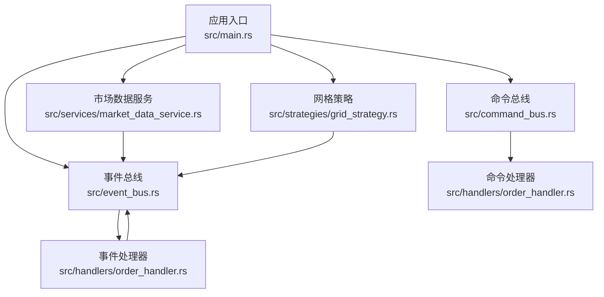
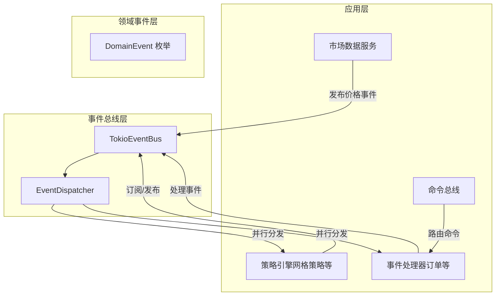
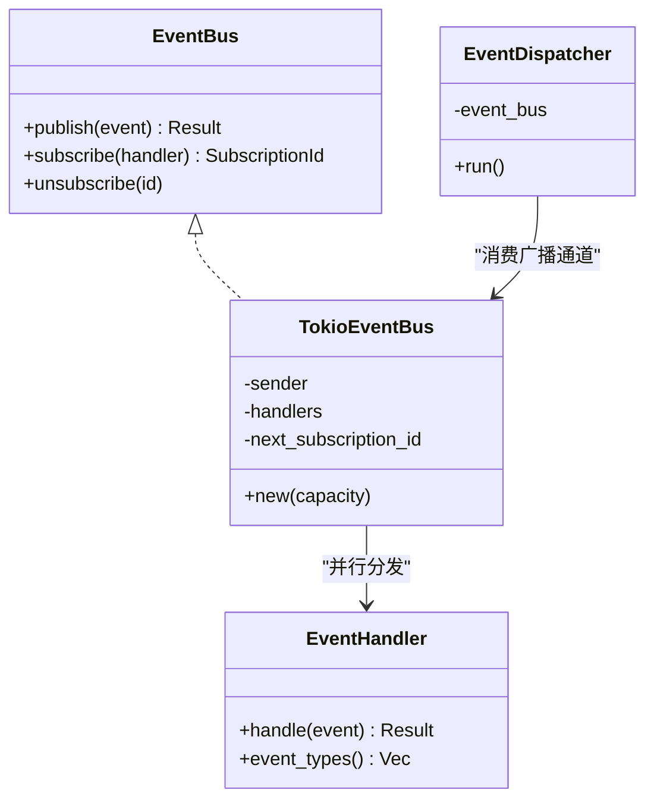
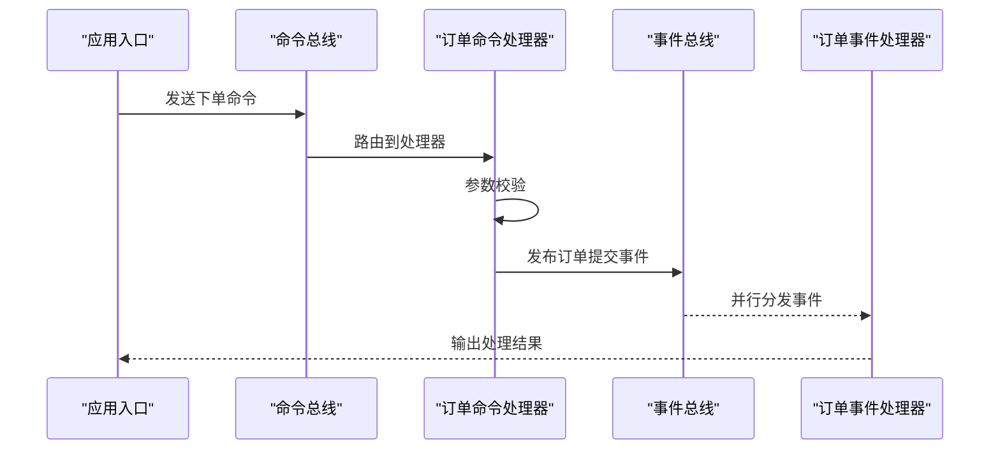
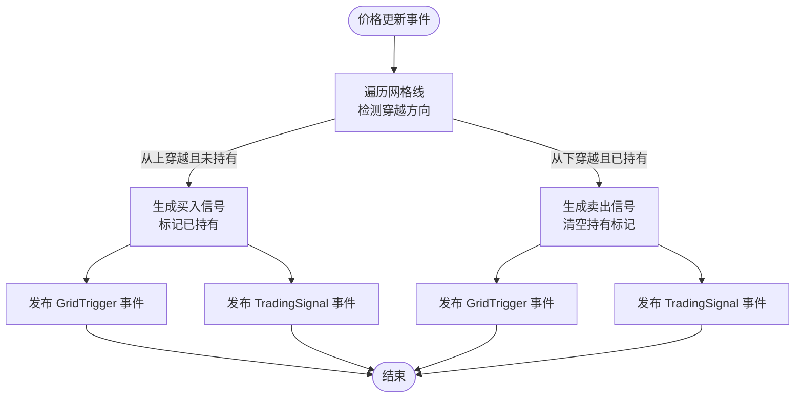
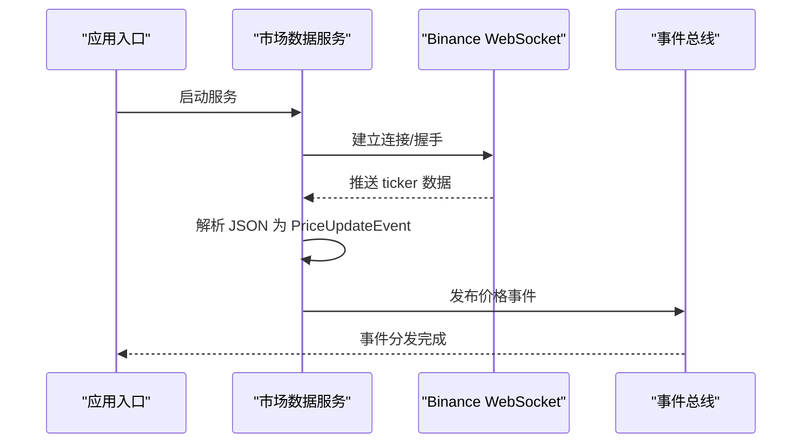
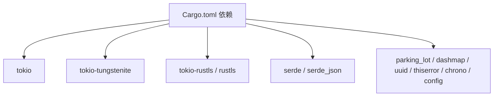

# 项目概述

<cite>
**本文引用的文件**
- [Cargo.toml](file://Cargo.toml)
- [lib.rs](file://src/lib.rs)
- [main.rs](file://src/main.rs)
- [event_bus.rs](file://src/event_bus.rs)
- [command_bus.rs](file://src/command_bus.rs)
- [mod.rs](file://src/commands/mod.rs)
- [order_commands.rs](file://src/commands/order_commands.rs)
- [order_handler.rs](file://src/handlers/order_handler.rs)
- [mod.rs](file://src/events/mod.rs)
- [grid_strategy.rs](file://src/strategies/grid_strategy.rs)
- [market_data_service.rs](file://src/services/market_data_service.rs)
- [error.rs](file://src/error.rs)
- [error.rs](file://src/infrastructure/error/error.rs)
- [CODE_EXPLANATION.md](file://docs/CODE_EXPLANATION.md)
- [EVENT_DRIVEN_REFACTOR_GUIDE.md](file://docs/EVENT_DRIVEN_REFACTOR_GUIDE.md)
</cite>

## 目录
1. [引言](#引言)
2. [项目结构](#项目结构)
3. [核心组件](#核心组件)
4. [架构总览](#架构总览)
5. [详细组件分析](#详细组件分析)
6. [依赖关系分析](#依赖关系分析)
7. [性能考量](#性能考量)
8. [故障排查指南](#故障排查指南)
9. [结论](#结论)
10. [附录](#附录)

## 引言
本项目是一个基于事件驱动架构（EDA）的加密货币量化交易系统，使用 Rust 语言开发，对接 Binance 交易所，旨在解决传统交易系统在实时性、扩展性和可观测性方面的痛点。通过发布-订阅模式、松耦合组件与异步处理机制，系统能够以极低延迟响应市场变化，并支持多策略并行、可插拔的事件处理器与统一的错误处理。

项目在量化交易领域的定位是“事件驱动的实时交易中枢”，既可作为教学与实验平台，也可作为生产级交易系统的演进基础。

## 项目结构
项目采用按领域分层与按功能模块划分相结合的组织方式：
- 应用入口与装配：main.rs 负责初始化事件总线、启动分发器、注册策略与服务。
- 事件与命令：events 定义领域事件；commands 定义命令及其结果模型。
- 事件总线与命令总线：event_bus 提供发布/订阅与分发；command_bus 将命令路由至处理器。
- 领域服务：services 提供市场数据服务等；strategies 提供策略引擎（如网格策略）。
- 基础设施与错误：infrastructure 提供日志与错误基础设施；error 提供统一错误类型。

图表来源
- [main.rs:10-93](file://src/main.rs#L10-L93)
- [event_bus.rs:18-110](file://src/event_bus.rs#L18-L110)
- [command_bus.rs:1-19](file://src/command_bus.rs#L1-L19)
- [market_data_service.rs:34-114](file://src/services/market_data_service.rs#L34-L114)
- [grid_strategy.rs:156-278](file://src/strategies/grid_strategy.rs#L156-L278)
- [order_handler.rs:9-91](file://src/handlers/order_handler.rs#L9-L91)

章节来源
- [lib.rs:1-9](file://src/lib.rs#L1-L9)
- [main.rs:10-93](file://src/main.rs#L10-L93)

## 核心组件
- 事件总线与事件分发器：基于 Tokio broadcast channel，支持多订阅者并行处理，具备背压与错误隔离能力。
- 命令总线：将命令路由到对应的处理器，当前实现支持下单命令。
- 事件定义：统一的 DomainEvent 枚举，涵盖市场、交易、账户、策略与风控事件。
- 策略引擎：网格策略监听价格事件，穿越网格线时生成交易信号并发布事件。
- 市场数据服务：通过 WebSocket 连接 Binance，支持直连与代理模式，具备自动重连与心跳维持。
- 统一错误处理：分层错误类型（基础设施、事件总线、命令总线、服务），统一对外暴露 DomainError。

章节来源
- [event_bus.rs:18-158](file://src/event_bus.rs#L18-L158)
- [command_bus.rs:1-19](file://src/command_bus.rs#L1-L19)
- [mod.rs:48-89](file://src/events/mod.rs#L48-L89)
- [grid_strategy.rs:156-278](file://src/strategies/grid_strategy.rs#L156-L278)
- [market_data_service.rs:34-114](file://src/services/market_data_service.rs#L34-L114)
- [error.rs:12-34](file://src/error.rs#L12-L34)

## 架构总览
系统采用事件驱动架构，核心思想是“事件生产者 → 发布事件 → 事件总线 → 订阅者处理”。市场数据服务产生价格事件，策略引擎与风控模块订阅感兴趣事件，命令总线接收外部命令并转化为领域事件，形成闭环。

图表来源
- [EVENT_DRIVEN_REFACTOR_GUIDE.md:72-104](file://docs/EVENT_DRIVEN_REFACTOR_GUIDE.md#L72-L104)
- [event_bus.rs:62-158](file://src/event_bus.rs#L62-L158)
- [grid_strategy.rs:156-278](file://src/strategies/grid_strategy.rs#L156-L278)
- [order_handler.rs:68-91](file://src/handlers/order_handler.rs#L68-L91)
- [command_bus.rs:8-18](file://src/command_bus.rs#L8-L18)

## 详细组件分析

### 事件总线与事件分发器
- EventBus Trait 定义发布/订阅/取消订阅接口；TokioEventBus 基于 broadcast channel 实现，具备背压与容量控制。
- EventDispatcher 独立任务，从广播通道接收事件，读取当前所有处理器并行执行，错误隔离，互不影响。
- EventType 枚举用于订阅过滤，降低无关事件处理开销。

图表来源
- [event_bus.rs:18-110](file://src/event_bus.rs#L18-L110)
- [event_bus.rs:112-158](file://src/event_bus.rs#L112-L158)

章节来源
- [event_bus.rs:18-158](file://src/event_bus.rs#L18-L158)

### 命令总线与命令处理
- Command 枚举与 CommandResult 定义命令类型与结果语义（成功/失败/受理中）。
- CommandBus 将命令路由到对应处理器；当前实现支持下单命令，处理器负责参数校验与发布订单提交事件。
- 订单处理器实现 EventHandler，订阅订单生命周期事件并输出日志（后续可接入风控与账户同步）。

图表来源
- [command_bus.rs:8-18](file://src/command_bus.rs#L8-L18)
- [order_handler.rs:93-137](file://src/handlers/order_handler.rs#L93-L137)
- [order_handler.rs:68-91](file://src/handlers/order_handler.rs#L68-L91)

章节来源
- [mod.rs:6-77](file://src/commands/mod.rs#L6-L77)
- [order_commands.rs:36-72](file://src/commands/order_commands.rs#L36-L72)
- [command_bus.rs:1-19](file://src/command_bus.rs#L1-L19)
- [order_handler.rs:9-91](file://src/handlers/order_handler.rs#L9-L91)

### 网格策略引擎
- GridConfig 定义策略配置（区间、网格数量、每格数量、止盈阈值等）。
- GridStrategy 实现 EventHandler，订阅价格事件，检测穿越网格线并生成交易信号，发布 GridTrigger 与 TradingSignal 事件。
- 策略内部维护 GridState（网格线、上次价格、信号计数），保证同格不重复触发。

图表来源
- [grid_strategy.rs:102-153](file://src/strategies/grid_strategy.rs#L102-L153)
- [grid_strategy.rs:264-278](file://src/strategies/grid_strategy.rs#L264-L278)

章节来源
- [grid_strategy.rs:26-81](file://src/strategies/grid_strategy.rs#L26-L81)
- [grid_strategy.rs:156-278](file://src/strategies/grid_strategy.rs#L156-L278)

### 市场数据服务（WebSocket）
- 支持直连与代理模式（Auto/Direct/Proxy），自动检测 HTTPS_PROXY 环境变量。
- 通过 HTTP CONNECT 隧道在代理环境下建立端到端加密连接，维持心跳与自动重连。
- 解析 Binance WebSocket 的 ticker 数据，封装为 PriceUpdateEvent 并发布到事件总线。

图表来源
- [market_data_service.rs:96-114](file://src/services/market_data_service.rs#L96-L114)
- [market_data_service.rs:116-178](file://src/services/market_data_service.rs#L116-L178)
- [market_data_service.rs:303-374](file://src/services/market_data_service.rs#L303-L374)
- [market_data_service.rs:376-407](file://src/services/market_data_service.rs#L376-L407)

章节来源
- [market_data_service.rs:23-82](file://src/services/market_data_service.rs#L23-L82)
- [market_data_service.rs:116-178](file://src/services/market_data_service.rs#L116-L178)
- [market_data_service.rs:303-407](file://src/services/market_data_service.rs#L303-L407)

### 统一错误处理
- DomainError 作为统一错误出口，内部包含基础设施、事件总线、命令总线、服务等分层错误。
- InfrastructureError、EventBusError、CommandBusError、ServiceError 提供细粒度错误类型与便捷构造方法。
- 错误在各层自动转换，便于定位与处理。

章节来源
- [error.rs:12-34](file://src/error.rs#L12-L34)
- [error.rs:36-83](file://src/error.rs#L36-L83)
- [error.rs:85-112](file://src/error.rs#L85-L112)
- [error.rs:114-128](file://src/error.rs#L114-L128)

## 依赖关系分析
- 运行时与异步：Tokio 提供异步运行时、广播通道与任务调度。
- WebSocket：tokio-tungstenite、tokio-rustls、rustls、webpki-roots 实现 WSS 连接与 TLS 握手。
- 序列化：serde、serde_json 用于事件与消息的序列化。
- 并发与数据结构：parking_lot、dashmap 提供高性能锁与并发映射。
- 日志与环境：log、env_logger、chrono、uuid、thiserror、config 等。

图表来源
- [Cargo.toml:6-24](file://Cargo.toml#L6-L24)

章节来源
- [Cargo.toml:6-24](file://Cargo.toml#L6-L24)

## 性能考量
- 异步与并行：事件分发器使用 join_all 并行处理所有订阅者，显著提升吞吐。
- 背压与容量：广播通道具备背压，避免过载丢失旧事件；可通过容量参数调节。
- 低开销事件：事件以引用传入处理器，避免大对象克隆。
- WebSocket 高效：只在有数据时传输，配合心跳维持连接，减少无效轮询。
- 线程安全：Arc + RwLock 管理处理器集合，允许多读者/单写者模式。

## 故障排查指南
- WebSocket 连接失败
  - 检查代理配置：确认 HTTPS_PROXY 或 https_proxy 环境变量是否正确。
  - 代理隧道：确认代理服务器可达，CONNECT 成功返回 200。
  - TLS 握手：确认证书链与服务器名称匹配。
- 事件未到达订阅者
  - 确认订阅类型过滤：EventHandler.event_types 是否包含目标事件。
  - 检查 EventDispatcher 是否已就绪并开始分发。
- 命令执行失败
  - 参数校验：下单数量必须大于 0。
  - 事件发布：检查事件总线是否成功发布，是否存在处理器错误。
- 错误定位
  - 使用统一 DomainError，结合分层错误类型快速定位来源模块。

章节来源
- [market_data_service.rs:137-164](file://src/services/market_data_service.rs#L137-L164)
- [market_data_service.rs:231-301](file://src/services/market_data_service.rs#L231-L301)
- [order_handler.rs:102-135](file://src/handlers/order_handler.rs#L102-L135)
- [error.rs:12-34](file://src/error.rs#L12-L34)

## 结论
本项目以事件驱动为核心，通过发布-订阅与异步并行处理，有效解决了传统交易系统在实时性、扩展性与可观测性方面的挑战。系统模块职责清晰、边界明确，具备良好的演进空间：可在现有基础上接入风控、订单执行、账户同步与监控告警等模块，逐步构建完整的事件驱动交易中枢。

## 附录

### 技术栈概览
- 异步运行时与通道：Tokio、broadcast channel
- WebSocket：tokio-tungstenite、tokio-rustls、rustls、webpki-roots
- 序列化：serde、serde_json
- 并发与工具：parking_lot、dashmap、uuid、thiserror、chrono、config

章节来源
- [Cargo.toml:6-24](file://Cargo.toml#L6-L24)

### 快速开始
- 启动步骤
  - 启动事件总线与分发器，等待就绪通知。
  - 初始化命令总线，发送下单命令，查看执行结果。
  - 注册网格策略，订阅价格事件，观察网格交易信号。
  - 启动市场数据服务，接收实时行情，持续约 45 秒。
- 示例路径
  - [main.rs:10-93](file://src/main.rs#L10-L93)
  - [event_bus.rs:119-157](file://src/event_bus.rs#L119-L157)
  - [command_bus.rs:8-18](file://src/command_bus.rs#L8-L18)
  - [grid_strategy.rs:58-60](file://src/strategies/grid_strategy.rs#L58-L60)
  - [market_data_service.rs:78-82](file://src/services/market_data_service.rs#L78-L82)

章节来源
- [main.rs:10-93](file://src/main.rs#L10-L93)

### 项目特色功能
- 实时市场数据：WebSocket 接入 Binance，支持直连与代理模式。
- 网格交易策略：基于价格穿越网格线生成交易信号。
- 统一错误处理：分层错误类型与统一 DomainError。
- 事件驱动：事件总线与命令总线解耦组件，支持多策略并行。

章节来源
- [market_data_service.rs:23-82](file://src/services/market_data_service.rs#L23-L82)
- [grid_strategy.rs:156-278](file://src/strategies/grid_strategy.rs#L156-L278)
- [error.rs:12-34](file://src/error.rs#L12-L34)